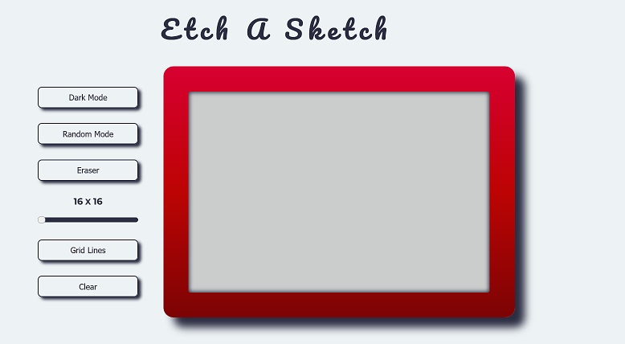

# Etch A Sketch

This is my version of the clasic toy _Etch a Sketck_.

I´ve done this project as part of the [Odin Project](https://www.theodinproject.com/lessons/foundations-etch-a-sketch) curriculum

## Summary

It´s fully playable from the browser

The app is responsive, but at the moment doesn´t work on mobile devices

## Built with

HTML
CSS
JavaScript

# Live Preview

[💻 Here](https://noasalgado.github.io/Etch-A-Sketch/)
